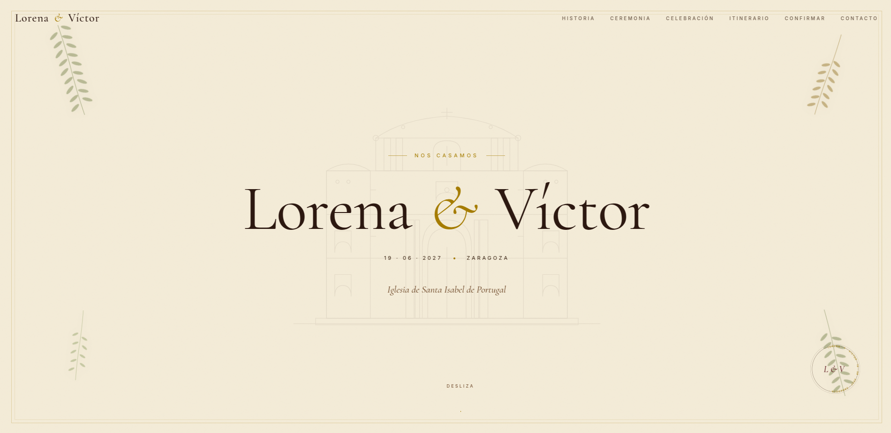

# 💍 Boda

Página web de nuestra boda, desarrollada como un sitio estático y alojada gratuitamente mediante **GitHub Pages**.

## 🌐 Sitio web

👉 https://victorbonasa.github.io/boda/

## ✨ Características

- Diseño responsive.
- Página completamente estática (HTML, CSS y JavaScript).
- Despliegue automático desde GitHub Pages.
- Sin dependencias ni proceso de compilación.

## 🚀 Desarrollo local

Clona el repositorio:

```bash
git clone https://github.com/VictorBonasa/boda.git
cd boda
```

Abre `index.html` directamente en el navegador o utiliza un servidor local, por ejemplo:

```bash
python3 -m http.server
```

Después visita:

```
http://localhost:8000
```

## 📁 Estructura

```
.
├── index.html
├── css/
├── js/
├── img/
└── README.md
```

## 📦 Despliegue

El sitio se publica automáticamente mediante **GitHub Pages** desde la rama configurada del repositorio.

## 📄 Licencia

Proyecto personal creado para una boda. No está destinado a su distribución o reutilización sin autorización.
